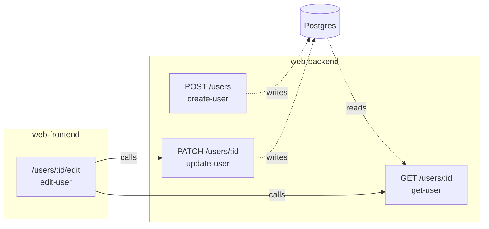
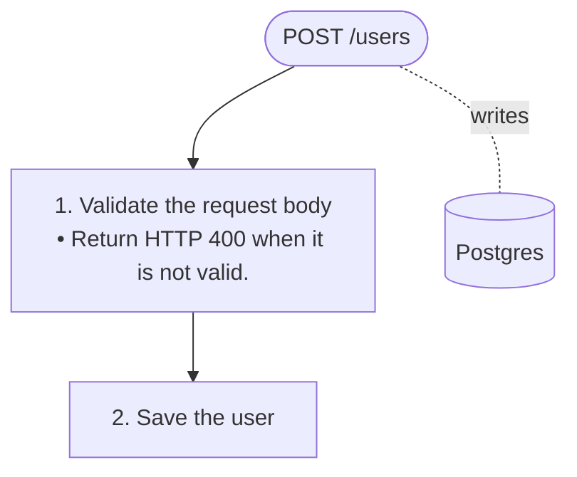
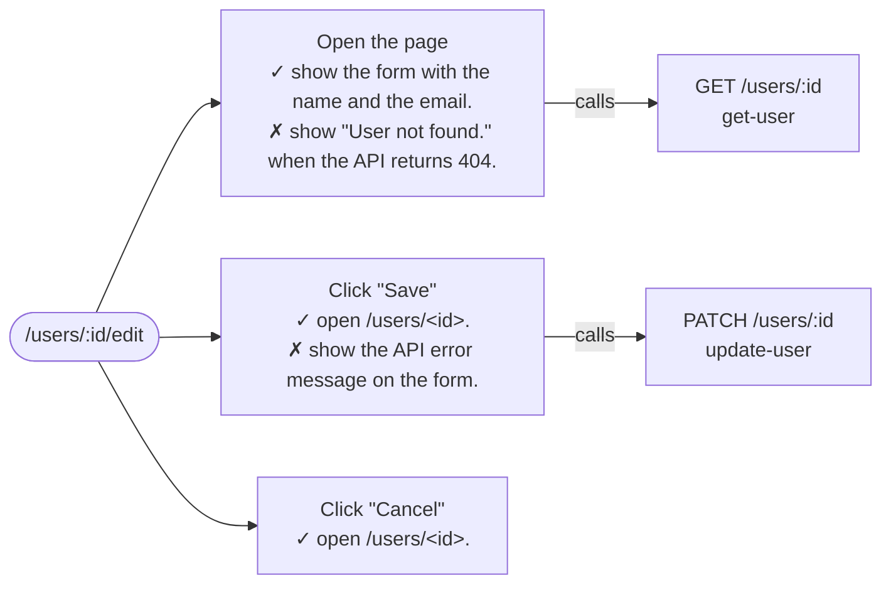

<!-- Generated by mirror:export from .mirror/xsrc/. Change the mirror, then export again. -->
# my-repo

## Links

```mermaid
flowchart LR
  subgraph p0 ["web-backend"]
    n0["POST /users<br/>create-user"]
    n1["GET /users/:id<br/>get-user"]
    n2["PATCH /users/:id<br/>update-user"]
  end
  subgraph p1 ["web-frontend"]
    n3["/users/:id/edit<br/>edit-user"]
  end
  n4[("Postgres")]
  n0 -.->|writes| n4
  n4 -.->|reads| n1
  n2 -.->|writes| n4
  n3 -->|calls| n1
  n3 -->|calls| n2
```

## web-backend/create-user

```mermaid
flowchart TD
  s0(["POST /users"])
  s1["1. Validate the request body<br/>• Return HTTP 400 when it is not valid."]
  s2["2. Save the user"]
  s0 --> s1 --> s2
  x0[("Postgres")]
  s0 -.-|writes| x0
```

## web-frontend/edit-user

```mermaid
flowchart LR
  s0(["/users/:id/edit"])
  a1["Open the page<br/>✓ show the form with the name and the email.<br/>✗ show #quot;User not found.#quot; when the API returns 404."]
  a2["Click #quot;Save#quot;<br/>✓ open /users/#lt;id#gt;.<br/>✗ show the API error message on the form."]
  a3["Click #quot;Cancel#quot;<br/>✓ open /users/#lt;id#gt;."]
  s0 --> a1
  s0 --> a2
  s0 --> a3
  t0["GET /users/:id<br/>get-user"]
  t1["PATCH /users/:id<br/>update-user"]
  a1 -->|calls| t0
  a2 -->|calls| t1
```
